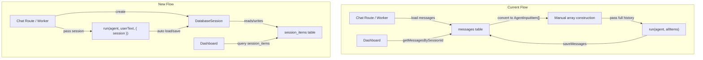

# Agent Session Integration

## Problem

Both the [chat API route](app/api/chat/[builderId]/route.ts) and the [WhatsApp worker](lib/queue/whatsapp-worker.ts) manually load messages from the DB, convert them to `AgentInputItem[]`, and pass the full history array to `run()`. This logic is duplicated and fragile -- it only captures user/assistant text messages, losing tool calls, function results, and other item types between turns. The `messages` table and `session_items` would duplicate data.

## Solution

Replace `messages` with `session_items` entirely. The `Session` interface from `@openai/agents` handles all persistence -- the runner automatically fetches prior items and stores new ones (user input, assistant output, tool calls, etc.). The dashboard reads conversation data from `session_items` directly.

## Architecture




## Changes

### 1. Schema: Add `session_items`, remove `messages`

In [lib/db/schema.ts](lib/db/schema.ts):

**Add** `index` to the `drizzle-orm/pg-core` import, then add:

```typescript
export const sessionItems = pgTable('session_items', {
  id: uuid().primaryKey().default(sql`gen_random_uuid()`),
  session_id: uuid()
    .notNull()
    .references(() => sessions.id, { onDelete: 'cascade' }),
  item_data: jsonb().notNull(),
  sequence: integer().notNull(),
  created_at: timestamp({ withTimezone: true }).default(sql`now()`).notNull(),
}, (t) => [
  index('session_items_seq_idx').on(t.session_id, t.sequence),
  unique('session_items_seq_unique').on(t.session_id, t.sequence),
]);
```

**Remove** the `messages` table definition and the `Message` type export.

Each row stores one `AgentInputItem` as JSONB. The `sequence` column preserves ordering. Foreign key cascades from the existing `sessions.id`.

### 2. Create `DatabaseSession` class

New file: `**lib/ai/session.ts`**

Implements the `Session` interface from `@openai/agents` with five methods:

- `getSessionId()` -- returns the existing session UUID
- `getItems(limit?)` -- queries `session_items` ordered by `sequence`, returns `item_data` cast as `AgentInputItem[]`
- `addItems(items)` -- in a transaction: get max sequence, insert items with incrementing sequence numbers, update session `updated_at`
- `popItem()` -- in a transaction: select last item by sequence `DESC`, delete it, return `item_data`
- `clearSession()` -- delete all `session_items` rows for this session

Constructor takes the existing `sessions.id` (UUID string). Sessions are already created by `getOrCreateSession` keyed on `(builder_id, platform, external_id)`.

### 3. Simplify chat API route

In [app/api/chat/[builderId]/route.ts](app/api/chat/[builderId]/route.ts):

**Remove:**

- `saveMessages` and `getMessagesBySessionId` imports
- All manual history loading (lines 57-68) and `allItems` assembly (lines 89-92)
- Both `saveMessages()` calls (user on line 72, assistant on line 117)
- `extractTextFromContent` helper (lines 145-157)

**Add:**

- `import { DatabaseSession } from "@/lib/ai/session"`
- After `getOrCreateSession`: `const dbSession = new DatabaseSession(session.id)`
- Change run call to: `run(agent, latestText, { stream: true, context, maxTurns: 8, session: dbSession })`

The session handles persisting the user input before streaming and the assistant output + tool calls after the stream completes.

### 4. Simplify WhatsApp worker

In [lib/queue/whatsapp-worker.ts](lib/queue/whatsapp-worker.ts):

**Remove:**

- `saveMessages` and `getMessagesBySessionId` imports
- Both `saveMessages()` calls (user on line 65, assistant on line 102)
- Manual `history` array construction (lines 74-85)
- `extractTextFromContent` helper (lines 135-147)

**Add:**

- `import { DatabaseSession } from "@/lib/ai/session"`
- After `getOrCreateSession`: `const dbSession = new DatabaseSession(session.id)`
- Change run call to: `run(agent, message.text, { context, maxTurns: 8, session: dbSession })`

### 5. Update session queries

In [lib/db/queries/sessions.ts](lib/db/queries/sessions.ts):

- Replace the `messages` join in `getSessionsByBuilderId` with a join on `sessionItems` for the item count
- Add a new `getSessionItemsBySessionId(sessionId)` function that queries `sessionItems` ordered by `sequence` and returns the rows (with `item_data`, `sequence`, `created_at`)

### 6. Update dashboard pages and components

**[Session detail page](app/(dashboard)/builders/[builderId]/sessions/[sessionId]/page.tsx):**

- Replace `getMessagesBySessionId` with the new `getSessionItemsBySessionId`
- Pass session items to `ConversationView`

**[ConversationView component](components/sessions/conversation-view.tsx):**

- Change props from `Message[]` to `SessionItem[]` (the `sessionItems` row type)
- Filter items to display only user and assistant messages (skip tool call items, function results, etc.)
- Extract text from `item_data`: for user items `item_data.content` (string or content parts), for assistant items look for `output_text` content parts
- Keep the existing bubble layout and timestamps (use `created_at` from the session item row)

**[SessionsTable component](components/sessions/sessions-table.tsx):**

- Update `SessionWithCount` type to use new `item_count` field name (cosmetic, rename `message_count` to `item_count`)

### 7. Clean up messages

In [lib/db/queries/messages.ts](lib/db/queries/messages.ts):

- Remove `saveMessages` and `getMessagesBySessionId` functions
- Remove `messages` and `Message` imports
- Keep document-related functions (`getDocumentsByProjectId`, `createDocument`, `deleteDocument`) -- rename file to `documents.ts` for clarity

Update imports in [projects page](app/(dashboard)/builders/[builderId]/projects/[projectId]/page.tsx) and [uploads action](actions/uploads.ts) that import from `messages.ts`.

### 8. Push schema to database

Run `pnpm db:push` to apply the schema diff (add `session_items` table, drop `messages` table).

## Notes

- The `Session` type from `@openai/agents` conflicts with the existing `Session` type in `lib/db/schema.ts`. The `DatabaseSession` file imports from `@openai/agents` as `import type { Session as AgentSession }` to avoid collision.
- Existing sessions will start with empty `session_items` history. First turn after migration begins fresh agent memory. Old `messages` data will be lost on `db:push` -- this is acceptable since we're in development.
- `AgentInputItem` is a union type (user messages, assistant messages, tool calls, tool results, etc.). The `ConversationView` filters for displayable items by checking `item_data.role === 'user'` or `item_data.role === 'assistant'`.

