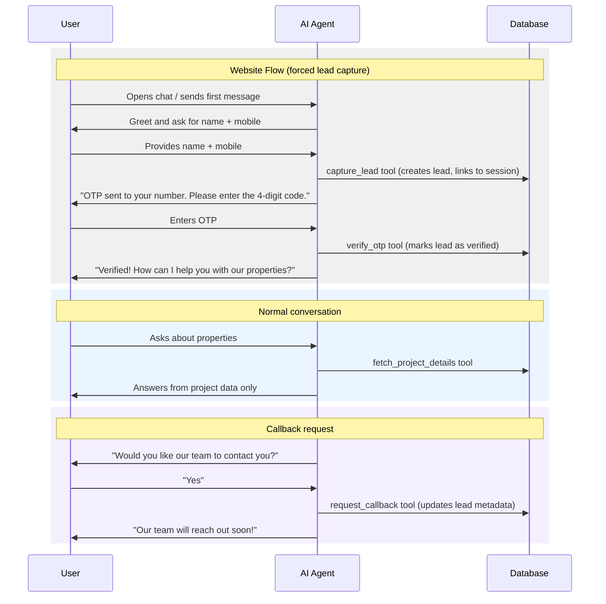

# AI Agent: Lead Capture, OTP Verification, and Real Estate Guardrails

## Current State

The agent (`[lib/ai/agent.ts](lib/ai/agent.ts)`) already has three tools: `fetch_project_details`, `capture_lead`, and `verify_otp`. The system prompt (`[lib/ai/instructions.ts](lib/ai/instructions.ts)`) includes project summaries but lacks strict real-estate guardrails and platform-specific lead-capture enforcement. Sessions can exist without an associated lead.

## Architecture

## Changes

### 1. Update system prompt with platform-aware instructions

**File:** `[lib/ai/instructions.ts](lib/ai/instructions.ts)`

- Accept `platform` parameter in `buildSystemPrompt(builder, projects, platform)`
- Add strict real-estate-only guardrails: refuse to answer questions unrelated to real estate or the builder's projects
- Add **website-specific instructions**: the agent MUST collect name and mobile via `capture_lead` before answering any property questions. After capture, tell the user a dummy OTP has been sent and ask them to enter it. Only proceed to answer questions after OTP verification.
- Add **WhatsApp-specific instructions**: the agent should ask for the user's name early (phone number is already known from WhatsApp), then capture the lead. No OTP needed since WhatsApp already verifies identity.
- Add instructions for the `request_callback` tool: after answering a few questions or when the user shows strong interest, ask if they'd like the builder's team to call them.

### 2. Update agent to pass platform and add new tool

**File:** `[lib/ai/agent.ts](lib/ai/agent.ts)`

- Pass `platform` to `buildSystemPrompt(builder, projects, platform)`
- Add `request_callback` tool to the tools object
- Increase `maxSteps` from 5 to 8 (the forced lead capture + OTP flow will consume more tool steps)

### 3. Create the `request_callback` tool

**New file:** `[lib/ai/tools/request-callback.ts](lib/ai/tools/request-callback.ts)`

- Input: `leadId` (string), `preferred_time` (optional string)
- Updates the lead's `metadata` JSONB field with `{ contact_requested: true, preferred_time, requested_at }` using the existing `updateLead` query
- Returns a success message confirming the builder's team will reach out

### 4. Update `capture_lead` tool for OTP awareness

**File:** `[lib/ai/tools/capture-lead.ts](lib/ai/tools/capture-lead.ts)`

- After successfully creating the lead, return the `leadId` **and** a message indicating an OTP has been "sent" (dummy) to the mobile number
- The return value should instruct the agent to ask the user to provide the 4-digit OTP
- This gives the agent the `leadId` it needs to pass to `verify_otp` in the next step

### 5. Auto-create lead for WhatsApp sessions

**File:** `[lib/queue/whatsapp-worker.ts](lib/queue/whatsapp-worker.ts)`

- After `getOrCreateSession`, check if the session already has a `lead_id`
- If not, auto-create a lead with `name: "WhatsApp User"` and `mobile: message.from`, then link it to the session via `updateSessionLead`
- The agent can later update the lead's name when the user provides it (update the `capture_lead` tool to handle updates if a lead already exists for the session)

### 6. Update `capture_lead` to support upsert behavior

**File:** `[lib/ai/tools/capture-lead.ts](lib/ai/tools/capture-lead.ts)`

- Accept an optional `sessionId` check: if the session already has a lead, update the existing lead instead of creating a duplicate
- This handles the WhatsApp case where a placeholder lead is auto-created, and the agent later collects the user's actual name

**Supporting query:** Add `getLeadBySessionId` to `[lib/db/queries/leads.ts](lib/db/queries/leads.ts)` so the tool can check for existing leads.

### 7. No schema changes needed

- The `wants_callback` / `contact_requested` data will be stored in the existing `metadata` JSONB column on the `leads` table
- No migration required

